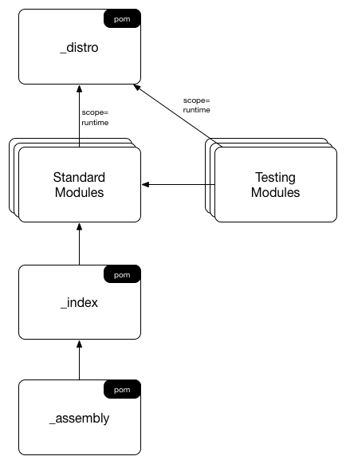

Effective OSGi Maven Archetypes
===============================

<!-- toc -->

- [Summary](#summary)
- [Bnd Installation](#bnd-installation)
  * [Installing Bnd with Homebrew for Mac OS](#installing-bnd-with-homebrew-for-mac-os)
  * [Running Bnd with Docker](#running-bnd-with-docker)
  * [Running Bnd on Other OSes](#running-bnd-on-other-oses)
- [Effective OSGi Project Layout](#effective-osgi-project-layout)
- [Archetype Usage](#archetype-usage)
  * [1. Generate a Parent Project](#1-generate-a-parent-project)
  * [2. Build and Run the Application](#2-build-and-run-the-application)
  * [3. Add a Bundle Module](#3-add-a-bundle-module)
  * [4. Add an Integration Test Module](#4-add-an-integration-test-module)
  * [5. Add Bundle(s) to the Application](#5-add-bundles-to-the-application)
    + [5.1. Refer to Bundle from Application](#51-refer-to-bundle-from-application)
    + [5.2. Resolve the Application](#52-resolve-the-application)
    + [5.3. Build and Run the Application](#53-build-and-run-the-application)
- [Licence](#licence)

<!-- tocstop -->

Summary
-------

This project contains Maven archetypes to accompany [Effective OSGi](https://effectiveosgi.com/):

* `eosgi-project-archetype`: Generates a parent project with default OSGi settings and an indexer module.
* `eosgi-module-archetype`: Generates a module project within a parent as generated by the above archetype.
* `eosgi-test-module-archetype`: Generates an integration testing module project within a parent as generated by the above archetype.

Bnd Installation
----------------

To work with these projects, we recommend installing bnd as a command-line tool.

### Installing Bnd with Homebrew for Mac OS

    brew install bnd

### Running Bnd with Docker

If you have Docker then you can use it to run bnd without installing anything in advance. To set this up, define an alias in your shell as follows:

    alias bnd='docker run -it --rm -v $HOME:$HOME -v $(pwd):/data bndtoolsorg/bnd:latest'

This line can be added to `~/.bash_profile` or its equivalent in other shells.

Note that the *first* time you run bnd this way it may take several minutes, because Docker must download all image files that you do not already have cached.

### Running Bnd on Other OSes

To run bnd on any other supported OS, download the following file:

    http://search.maven.org/remotecontent?filepath=biz/aQute/bnd/biz.aQute.bnd/3.5.0/biz.aQute.bnd-3.5.0.jar

...and execute with:

    java -jar /path/to/biz.aQute.bnd-3.5.0.jar

Effective OSGi Project Layout
-----------------------------

Refer to the linked documents for each top-level module:

* [_distro](eosgi-project-archetype/src/main/resources/archetype-resources/_distro/README.md)
* [_index](eosgi-project-archetype/src/main/resources/archetype-resources/_index/README.md)
* [_assembly](eosgi-project-archetype/src/main/resources/archetype-resources/_assembly/README.md)

Archetype Usage
---------------

### 1. Generate a Parent Project

Copy-paste the following lines to your command prompt:

    mvn archetype:generate \
    -DarchetypeGroupId=com.effectiveosgi \
    -DarchetypeVersion=0.0.2 \
    -DarchetypeArtifactId=eosgi-project-archetype

You will be asked to choose a group ID, artifact ID, version and Java package name for your new project. Enter `org.example` for the group ID and `example-parent` for the artifact ID. Accept the default values for all other inputs.

### 2. Build and Run the Application

The generated parent project contains an assembly module that is used to build OSGi applications. To build it and run:

    cd example-parent
    mvn package
    bnd run _assembly/application.bndrun

You are now inside an OSGi Framework containing the Gogo shell; try using the `lb` command to list installed bundles. Press Ctrl-D (or type `stop 0`) to exit OSGi.

It's also possible to run the same application with the same set of bundles as follows:

    java -jar _assembly/target/application.jar

### 3. Add a Bundle Module

In this step we add a new Maven module to build an OSGi bundle. From the `example-parent` directory run:

    mvn archetype:generate \
    -DarchetypeGroupId=com.effectiveosgi \
    -DarchetypeVersion=0.0.2 \
    -DarchetypeArtifactId=eosgi-module-archetype
    
Use `org.example` for the group ID and `org.example.hello` for the artifact ID.

Now you can open the project in your IDE and write some code. For example add the following to `Example.java` at the point where the "TODO" comment appears:

    @Activate
    void activate() {
        System.out.println("Hello World");
    }

Now you can build and run the bundle:

    mvn package
    bnd run org.example.hello/launch.bndrun

You should see the Hello World output.

### 4. Add an Integration Test Module

In this step we add a new Maven module that performs OSGi integration testing. I.e., it defines an OSGi bundle containing tests, runs that bundle in an OSGi Framework and reports the test results.

From the `example-parent` directory run:

    mvn archetype:generate \
    -DarchetypeGroupId=com.effectiveosgi \
    -DarchetypeVersion=0.0.2 \
    -DarchetypeArtifactId=eosgi-test-module-archetype

Use `org.example` for the group ID and `org.example.test` for the artifact ID. To run the integration tests:

    mvn verify

Note that the test provided by the template trivially passes. If you would like to prove that the test is actually running, try adding the following to `ExampleTest.java` at the point where the "TODO" comment appears, and then re-running `mvn verify`:

    fail("Bang!");

**N.B.:** remove this `fail` before proceeding to the next steps.

### 5. Add Bundle(s) to the Application

In step 2 you built an OSGi Application that contained only the Gogo shell. We would like to add our own bundles to this application, for example the bundle that was defined in step 3.

#### 5.1. Refer to Bundle from Application

First we need to reference our bundle module from the `_index` module. This module generates an OSGi repository index XML file as defined in section 132.5 of the [OSGi Compendium R6 specification](https://www.osgi.org/developer/downloads/release-6/). This index file is useful in itself for a number of purposes, but we will use it as a stepping stone to defining our application. Open `_index/pom.xml` and add the following dependency block following the "Workspace Dependencies" comment:

    <dependency>
      <groupId>${project.groupId}</groupId>
      <artifactId>org.example.hello</artifactId>
      <version>1.0-SNAPSHOT</version>
    </dependency>

Now edit `_assembly/application.bndrun` to specify that the application should contain the bundle `org.example.hello`. This is done by adding a line to the `-runrequires` section, which should now appear as follows:

    -runrequires: \
        osgi.identity;filter:='(osgi.identity=org.apache.felix.gogo.shell)',\
        osgi.identity;filter:='(osgi.identity=org.apache.felix.gogo.command)',\
        osgi.identity;filter:='(osgi.identity=org.example.hello)'

**N.B.:** Be sure to enter the last line exactly as shown and to add ",\" (comma backslash) to the previous line.

#### 5.2. Resolve the Application

Listing our bundle `org.example.hello` tells bnd that we want the bundle to be part of the application, however it's often not enough to include *just* that bundle. Many bundle have dependencies, for example libraries that they depend on and runtime framework that they expect to be present. Bnd's job is to assemble the application including all of these dependencies.

Now attempt to reassemble the application -- **note that this step is expected to fail!**

    mvn package

The reason for the failure is that we changed the **required** list of bundles for the application (i.e. the `-runrequires` section), but these requirements are not satisfied by the **actual** list of bundles, which are listed in the `-runbundles` section. In the build output you should see the following message:

    [ERROR] Error   : The runbundles have changed. Failing the build!
    Was: \
            org.apache.felix.gogo.command;version='[1.0.2,1.0.3)',\
            org.apache.felix.gogo.runtime;version='[1.0.6,1.0.7)',\
            org.apache.felix.gogo.shell;version='[1.0.0,1.0.1)'
    Is: \
            org.apache.felix.gogo.command;version='[1.0.2,1.0.3)',\
            org.apache.felix.gogo.runtime;version='[1.0.6,1.0.7)',\
            org.apache.felix.gogo.shell;version='[1.0.0,1.0.1)',\
            org.apache.felix.scr;version='[2.0.10,2.0.11)',\
            org.example.hello;version='[1.0.0,1.0.1)'

To fix the error, copy-paste the second list of bundles (following "Is: ") into the `-runbundles` section of `_assembly/application.bndrun`. That section should now look like this:

    -runbundles: \
            org.apache.felix.gogo.command;version='[1.0.2,1.0.3)',\
            org.apache.felix.gogo.runtime;version='[1.0.6,1.0.7)',\
            org.apache.felix.gogo.shell;version='[1.0.0,1.0.1)',\
            org.apache.felix.scr;version='[2.0.10,2.0.11)',\
            org.example.hello;version='[1.0.0,1.0.1)'

Now re-run the build, which should succeed:

    mvn package

#### 5.3. Build and Run the Application

The application can be launched as before, either with the bnd command line tool:

    bnd run _assembly/application.bndrun

Or using the standalone JAR file:

    java -jar _assembly/target/application.jar

Whichever way the application is executed, you should see that the `org.example.hello` bundle is included.

Licence
-------

Copyright 2017 Neil Bartlett

Licensed under the Apache License, Version 2.0 (the "License");
you may not use this file except in compliance with the License.
You may obtain a copy of the License at

[http://www.apache.org/licenses/LICENSE-2.0](http://www.apache.org/licenses/LICENSE-2.0)

Unless required by applicable law or agreed to in writing, software
distributed under the License is distributed on an "AS IS" BASIS,
WITHOUT WARRANTIES OR CONDITIONS OF ANY KIND, either express or implied.
See the License for the specific language governing permissions and
limitations under the License.
